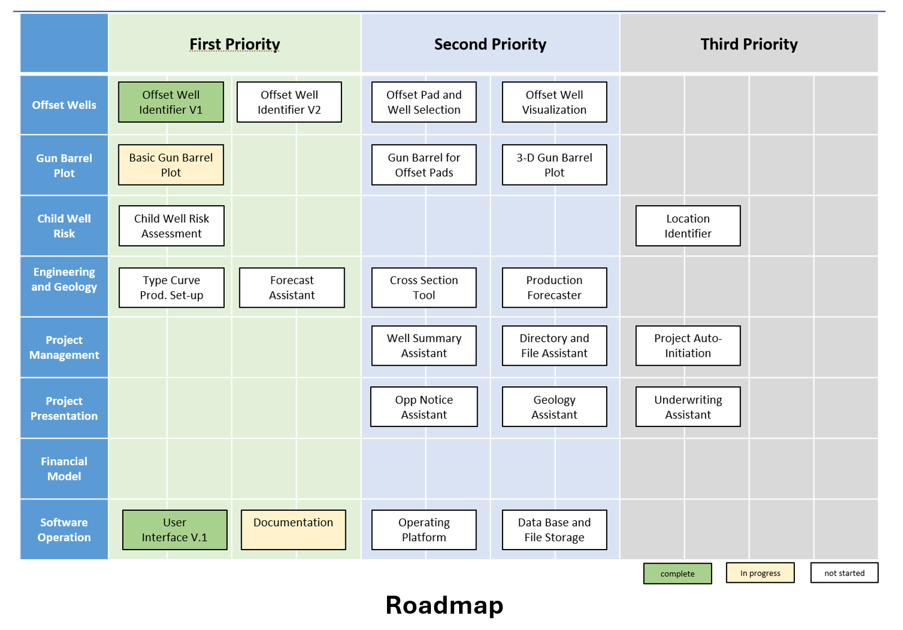

# AFE Analysis

## 1. The business problem and who the customers/users are

<span style="font-size:1.5em;">
The business problem consists of an oil and gas drilling investment firm (customer), with a significant amount of money to put into work. The customer desires to participate in more deals but is limited to a small number of deal participation, due to the lack of qualified financial analysts and off-the-self financial analysis automation solutions.
<br><br>
Energy industry Thought Leaders have indicated the marketplace for buying and selling oil and gas well working interest is to grow significantly in 2025 and beyond. But this marketplace will still be very competitive and fast paced, so potential investors must perform fast Return on Investment analysis, most of the time within a day or two of the deal’s offering.
<br><br>
It is proposed to build a custom automation software solution that will enable faster Return on Investment analysis thus potentially increasing deal participation and putting more investment money into work.

</span>

## 2. How you worked with them to make sure that your solution meets their needs

<span style="font-size:1.5em;">
As a technology consultant, I coordinated and led recurring work sessions to discover/document/learn current processes and demonstrated working software, that I developed. All work sessions were recorded, transcribed and summarized by AI then emailed to each team member. These summaries provided quality feedback, with sentiment, that helped ensure that the solution was meeting the client’s needs.
<br><br>
A simple roadmap document (below) was created, as a communications tool, that identified and prioritized key roadmap tasks that could be automated.

</span>



## 3. Demo the solution and explain how it addresses the business problem

<span style="font-size:1.5em;">
This demonstration will show how this solution automated several previously manual tasks, thus reclaiming up to 20 hours per deal, that was put to work on higher value tasks. Two of these automated tasks are: 
<br><br>
1. Reduce manual data entry, using OCR and AI to extract key attributes from the PDF and image files. The value-add here is the replacement of previous error prone copy-and-paste tasks of text from both PDFs and images into an Excel spreadsheet. The automated task now extracts the desired text feature and inserts them into a database to downstream processing.
<br><br>
2. Automation of deterministic tasks, such as “Offset Well Co-development Groups” and “Child Well Risk Gun Barrel Plot”. For example,
<br><br>
“Offset Well Co-development Groups” is a report that list groups well that will be used as a substitute for the projected future cash flows of the proposed well grouping and a key input to Return on Investment calculation.
<br><br>
“Child Well Risk Gun Barrel Plot” is a Scatter Plot that indicates any surround well groups to the proposed well group that could potentially imped the future cash flows. Any identified risk is subtracted from the future cash flows calculation.
<br><br>


</span>

## 4. Show and explain the architecture, platform, technical tools, language used, e.g., RAG model, AWS Bedrock, LangChain, python (strong preference) including which libraries, etc.

<span style="font-size:1.5em;">
Please see the Github repository <a href="https://github.com/stevethomas15977/public_afe/tree/main/app">AFE Public</a> for a complete list of technologies.
<br><br>
The web application is built using python. The python libraries may be viewed via this <a href="https://github.com/stevethomas15977/public_afe/blob/main/app/Pipfile">Pipfile</a>. The UI is built with <a href="https://nicegui.io/">NiceGUI<a>, which is a python-base SPA (Single Page Application) web framework. Database management is provided by SQLite. Excel generation is provided by python library <a href="https://xlsxwriter.readthedocs.io/">XLSXWriter</a>. Current AI and OCR technologies include ChatGPT and Amazon Textract. These technologies are used to extract text from a PDF with a custom python library <a href="https://github.com/stevethomas15977/public_afe/blob/main/app/helpers/anakarko_afe_helper.py">PDFHelper</a>.
<br><br>
NOTE: My goal here is to highlight my python programming skills and show how AI is used to automate previous manual tasks. If time allows, as the end, I would like to explain my plan to refactor this solution into an Agentic LLM application using an well-known agent orchestration framework, such as <a href="https://academy.langchain.com/courses/take/intro-to-langgraph)">LangGraph</a>
</span>

## 5. Explain how the solution was deployed, maintained, and supported

<span style="font-size:1.5em;">
The current version is a simple monolith web application running on AWS LightSail. LightSail is a very cost-effective compute solution for small to medium businesses. Compute components consist of a single load balancer for TLS termination and a target-group of EC2 instance running a python-based web application. See diagram below “AFE Analysis (v1.0).
<br><br>
The solution is deployed using <a href="https://github.com/stevethomas15977/public_afe/blob/main/.github/workflows/main.yaml">Github Actions</a>, <a href="https://github.com/stevethomas15977/public_afe/tree/main/terraform">Terraform</a>, and Linux BASH cloud-init scripting.
<br><br>
Maintain and support as included in a separate SLA engagement.

</span>

")

### Run within WLS Ubuntu 24.04 LTS and VS Code:
```
cd /app
python3 -m venv venv
. venv/bin/activate
pip install pipenv
pipenv sync

sh -c "cat > app/.env" <<EOG
PYTHONPATH="$PYTHONPATH:models:helpers:services:database"
VERSION="1.8"
HTTP_PORT="$HTTP_PORT"
PRIVATE_IPV4="$PRIVATE_IPV4"
ENV="$ENV"
APP="$APP"
APP_ROOT="$APP_ROOT"
AFE_PATH=$AFE_PATH
APP_PATH="$APP_PATH"
PROJECTS_PATH="$PROJECTS_PATH"
GEOJSON_PATH="$AFE_PATH/$S3_FOLDER_NAME"
CODEVELOPMENT_FIRST_PRODUCTION_DATE_DAYS_THRESHOLD=180
MAX_DISTANCE_THRESHOLD=8000
HORIZONTAL_DISTANCE_THRESHOLD=1600
VERTICAL_DISTANCE_THRESHOLD=500
LATERAL_LENGTH_THRESHOLD=.8
HYPOTENUSE_DISTANCE_THRESHOLD=1800
DEPTH_DISTANCE_THRESHOLD=1000
PCT_GROUP_CUM_OIL_GREATER_THAN_THRESHOLD=7.5
TEXAS_LAND_SURVEY_SYSTEM_DATABASE="texas_land_survey_system.db"
NEW_MEXICO_LAND_SURVEY_SYSTEM_DATABASE="new_mexico_land_survey_system_with_states.db"
NM_SECTION_COLUMN="FRSTDIVLAB"
TX_ABSTRACT_COLUMN="ABSTRACT_L"
USERNAME="$APP_USERNAME"
APP_SECRET="$APP_SECRET"
S3_BUCKET_NAME="$S3_BUCKET_NAME"
GEOJSON_PATH="$GEOJSON_PATH"
AFE_PROD_DNS="localhost"
APP="offset-well-identification"
PLSS_BUCKET="afe-plss"
LANGCHAIN_API_KEY="$LANGCHAIN_API_KEY"
LANGCHAIN_TRACING_V2="true"
OPENAI_API_KEY="$OPENAI_API_KEY"
AWS_DEFAULT_REGION="$AWS_DEFAULT_REGION"
AWS_ACCESS_KEY_ID="$AWS_ACCESS_KEY_ID"
AWS_SECRET_ACCESS_KEY="$AWS_SECRET_ACCESS_KEY"
EOG
```
