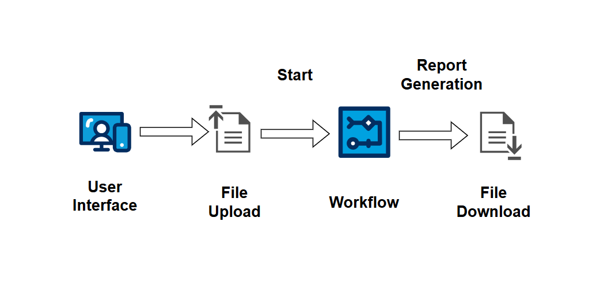
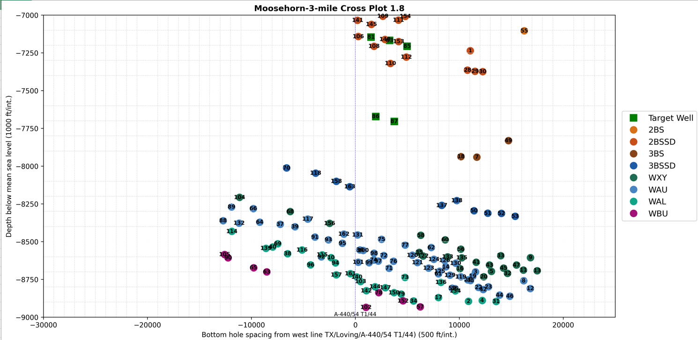
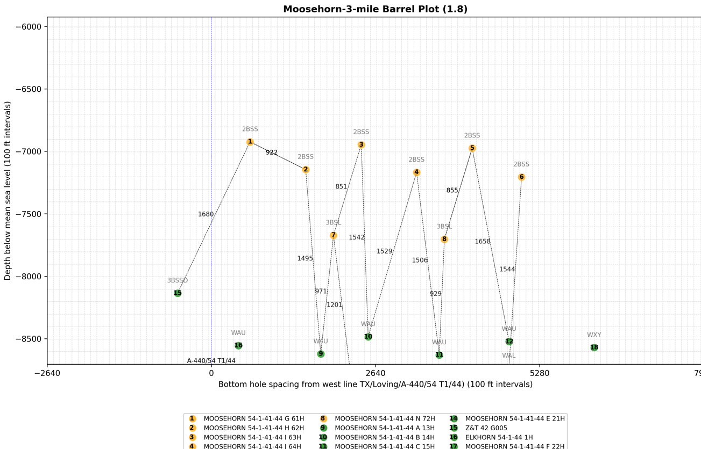
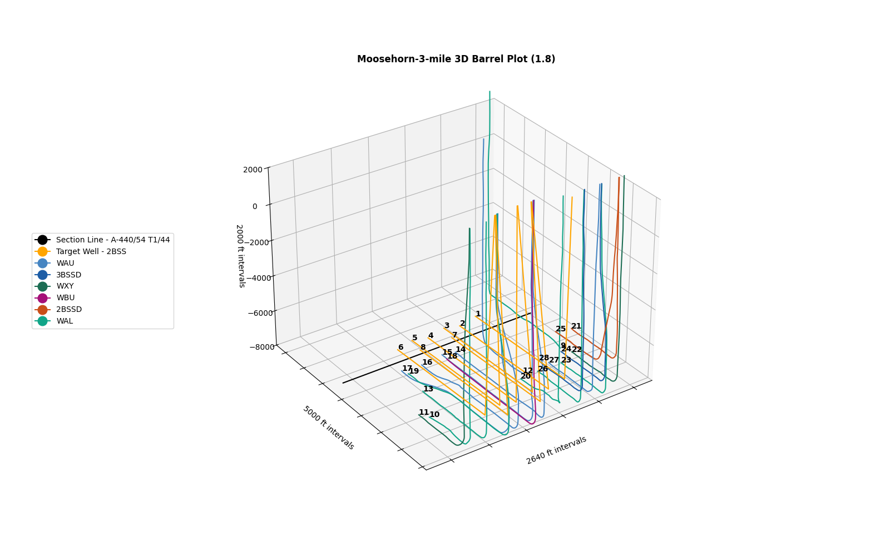
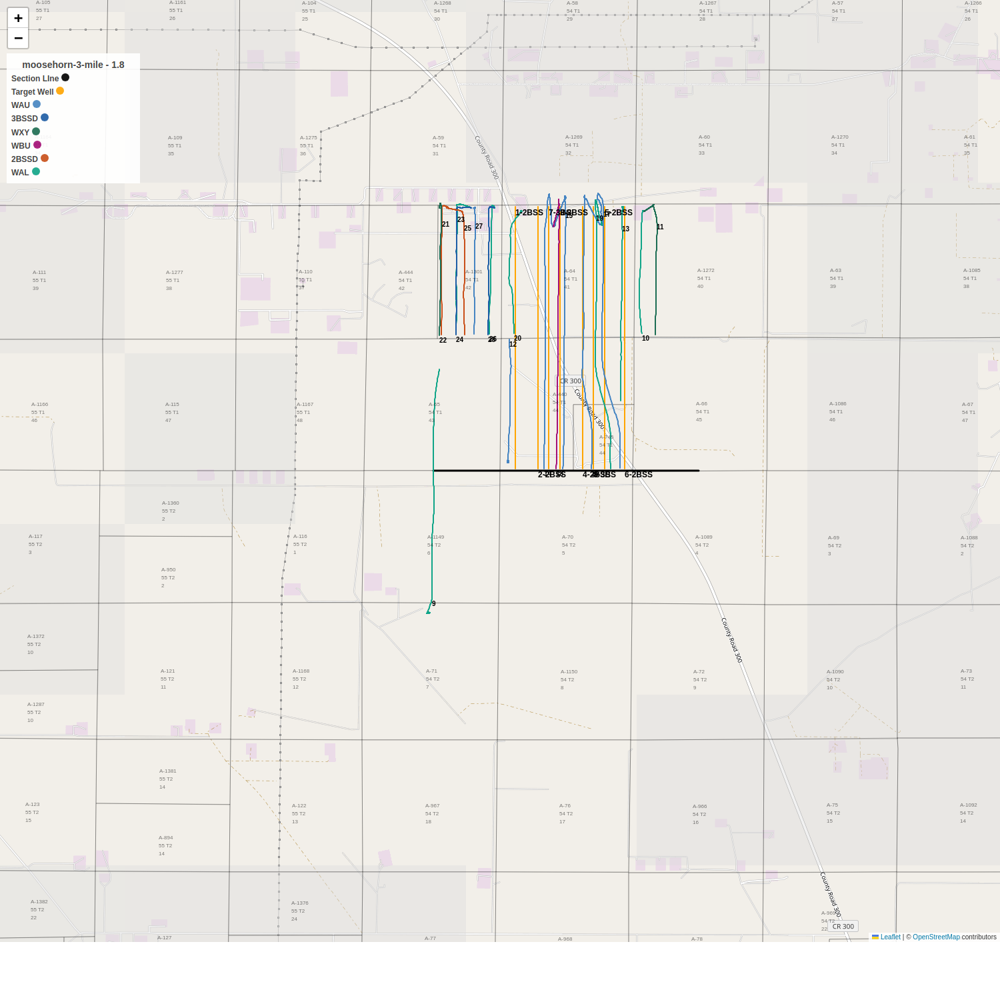
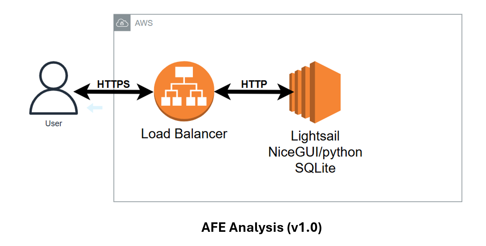

# Oil Well Investment Analysis Toolkit

A Python-based analytics platform that automates the preparation of **oil well drilling investment analysis artifacts** used in upstream oil & gas decision making.

This project demonstrates how **data engineering, geospatial analytics, and automated reporting** can assist petroleum engineers and financial analysts in preparing **AFE (Authorization for Expenditure) drilling proposals**.

The system transforms raw engineering and production datasets into **investor-ready Excel analysis workbooks** containing production comparisons, offset well evaluations, and engineering visualizations.

---

# Business Context

When an oil company evaluates whether to drill a new well, engineers must prepare a **technical and financial evidence package** supporting the investment.

This typically includes:

- Production performance of nearby wells  
- Geological context  
- Drilling cost estimates  
- Production forecasts  
- Engineering visualizations  

Preparing these materials manually can require **significant time gathering and analyzing data across multiple systems**.

This project demonstrates how a **Python analytics pipeline can automate this process**, producing standardized analysis artifacts for investment review meetings.

---

# Key Capabilities

The application automates several aspects of drilling opportunity analysis.

## Data Engineering

- Ingestion of engineering and production datasets  
- Structured transformation of raw well data  
- Normalization of well attributes  

## Offset Well Analysis

- Identification of nearby wells  
- Production comparison analytics  
- Spatial well relationship analysis  

## Automated Reporting

- Generation of multi-tab Excel investment analysis workbooks  
- Automated engineering charts and graphs  
- Standardized reporting artifacts  

## Engineering Visualization

- 2D barrel charts  
- 3D spatial well comparison charts  
- Well production comparison plots  

---

# Example Workflow

1. Petroleum engineer uploads project datasets  
2. Python pipeline ingests and processes well data  
3. Nearby wells are identified and analyzed  
4. Production performance comparisons are generated  
5. Excel investment workbook is automatically produced  

#### The final output becomes an investment review artifact supporting drilling decisions.

---

# Input Data Sources

The pipeline processes three primary input files.

## AFE Budget (PDF)

The **Authorization for Expenditure (AFE)** document contains:

- Drilling cost estimates  
- Project capital expenditures  
- Geological plat diagrams  
- Financial assumptions  

These values support **financial modeling and investment justification**.

---

## Proposed Well Dataset (Excel)

Contains candidate wells being evaluated for drilling.

Typical attributes include:

- Well name  
- API number  
- Surface location  
- Bottom hole location  
- Formation target  
- Drilling depth  

---

## Offset / Child Well Dataset (Excel)

Nearby wells used for production comparison and forecasting.

Typical attributes include:

- Well name  
- API identifier  
- Historical production volumes  
- Completion intervals  
- Geographic coordinates  

These wells act as **analog wells used to estimate expected production**.

---

# Output Artifacts

The application produces a **multi-tab Excel investment analysis workbook**.

## Example Tabs

- Proposed Wells  
- Offset Wells  
- Production Summary  
- Barrel Chart (2D)  
- Barrel Chart (3D)  
- Risk Analysis  

These artifacts are used during **drilling investment review meetings**.

### An example workbook generated by the system can be downloaded here:

#### Cross Plot

#### Barrel Plot

#### 3D Barrel Plot

#### Surface Map

##### See Github Repo directory "moosehorn-3-mile" for addition output artifacts
---

# Technologies Used

## Programming

- Python 3.12
- Bash on Ubuntu

## Data Engineering

- SQLite database
- Pandas  
- NumPy  

## Visualization

- Matplotlib  
- Excel native chart generation
- OpenMap

## File Processing

- OpenPyXL  
- XlsxWriter  
- PDF processing utilities

## Cloud Compute

- Github Actions 
- Terraform IaC
- LightSail instances
- S3
- HTTPS LoadBalancer w/ Auto Scaling Group

